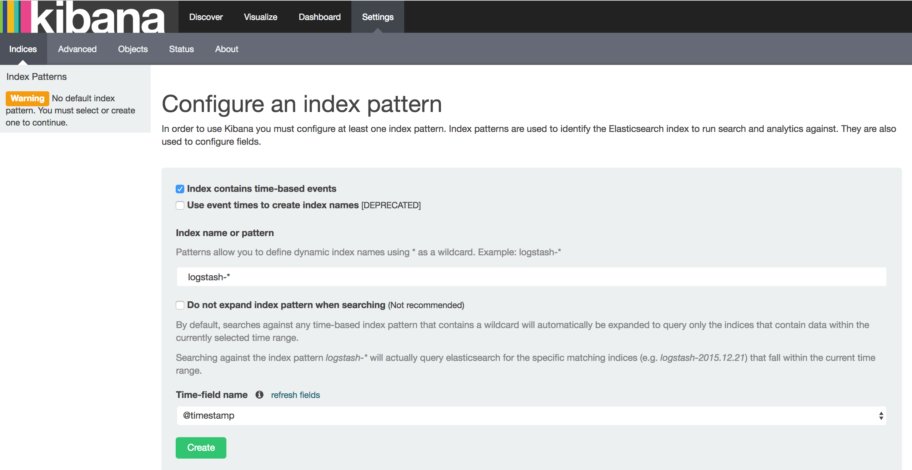
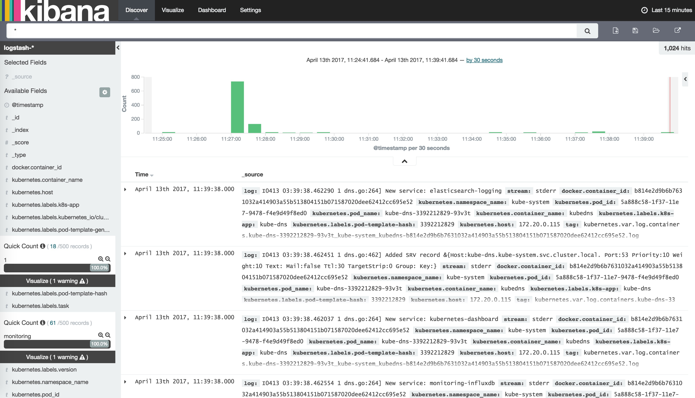

# 配置和安装 EFK

官方文件目录：`cluster/addons/fluentd-elasticsearch`

``` bash
$ ls *.yaml
es-controller.yaml  es-service.yaml  fluentd-es-ds.yaml  kibana-controller.yaml  kibana-service.yaml efk-rbac.yaml
```

同样EFK服务也需要一个`efk-rbac.yaml`文件，配置serviceaccount为`efk`。

已经修改好的 yaml 文件见：[EFK](./yaml/efk)


## 配置 es-controller.yaml

``` bash
#  cat es-controller.yaml 
apiVersion: v1
kind: ReplicationController
metadata:
  name: elasticsearch-logging-v1
  namespace: kube-system
  labels:
    k8s-app: elasticsearch-logging
    version: v1
    kubernetes.io/cluster-service: "true"
    addonmanager.kubernetes.io/mode: Reconcile
spec:
  replicas: 2
  selector:
    k8s-app: elasticsearch-logging
    version: v1
  template:
    metadata:
      labels:
        k8s-app: elasticsearch-logging
        version: v1
        kubernetes.io/cluster-service: "true"
    spec:
      serviceAccountName: efk
      containers:
      - image:  index.tenxcloud.com/docker_library/elasticsearch:2.2.0
        name: elasticsearch-logging
        resources:
          # need more cpu upon initialization, therefore burstable class
          limits:
            cpu: 1000m
          requests:
            cpu: 100m
        ports:
        - containerPort: 9200
          name: db
          protocol: TCP
        - containerPort: 9300
          name: transport
          protocol: TCP
        volumeMounts:
        - name: es-persistent-storage
          mountPath: /data
        env:
        - name: "NAMESPACE"
          valueFrom:
            fieldRef:
              fieldPath: metadata.namespace
      volumes:
      - name: es-persistent-storage
        emptyDir: {}

```

## 配置 es-service.yaml

无需修改

## 配置 fluentd-es-ds.yaml

``` bash
# cat fluentd-es-ds.yaml 
apiVersion: extensions/v1beta1
kind: DaemonSet
metadata:
  name: fluentd-es-v1.22
  namespace: kube-system
  labels:
    k8s-app: fluentd-es
    kubernetes.io/cluster-service: "true"
    addonmanager.kubernetes.io/mode: Reconcile
    version: v1.22
spec:
  template:
    metadata:
      labels:
        k8s-app: fluentd-es
        kubernetes.io/cluster-service: "true"
        version: v1.22
      # This annotation ensures that fluentd does not get evicted if the node
      # supports critical pod annotation based priority scheme.
      # Note that this does not guarantee admission on the nodes (#40573).
      annotations:
        scheduler.alpha.kubernetes.io/critical-pod: ''
    spec:
      serviceAccountName: fluentd
      containers:
      - name: fluentd-es
        image: index.tenxcloud.com/zhangshun/fluentd-elasticsearch:v1
        command:
          - '/bin/sh'
          - '-c'
          - '/usr/sbin/td-agent 2>&1 >> /var/log/fluentd.log'
        resources:
          limits:
            memory: 200Mi
          requests:
            cpu: 100m
            memory: 200Mi
        volumeMounts:
        - name: varlog
          mountPath: /var/log
        - name: varlibdockercontainers
          mountPath: /var/lib/docker/containers
          readOnly: true
      nodeSelector:
        beta.kubernetes.io/fluentd-ds-ready: "true"
      tolerations:
      - key : "node.alpha.kubernetes.io/ismaster"
        effect: "NoSchedule"
      terminationGracePeriodSeconds: 30
      volumes:
      - name: varlog
        hostPath:
          path: /var/log
      - name: varlibdockercontainers
        hostPath:
          path: /var/lib/docker/containers

```

## 配置 kibana-controller.yaml

``` bash
# cat kibana-controller.yaml 
apiVersion: extensions/v1beta1
kind: Deployment
metadata:
  name: kibana-logging
  namespace: kube-system
  labels:
    k8s-app: kibana-logging
    kubernetes.io/cluster-service: "true"
    addonmanager.kubernetes.io/mode: Reconcile
spec:
  replicas: 1
  selector:
    matchLabels:
      k8s-app: kibana-logging
  template:
    metadata:
      labels:
        k8s-app: kibana-logging
    spec:
      serviceAccountName: efk
      containers:
      - name: kibana-logging
        image: index.tenxcloud.com/docker_library/kibana:4.5.1
        resources:
          # keep request = limit to keep this container in guaranteed class
          limits:
            cpu: 100m
          requests:
            cpu: 100m
        env:
          - name: "ELASTICSEARCH_URL"
            value: "http://elasticsearch-logging:9200"
          - name: "KIBANA_BASE_URL"
            value: "/api/v1/proxy/namespaces/kube-system/services/kibana-logging"
        ports:
        - containerPort: 5601
          name: ui
          protocol: TCP

```

## 给 Node 设置标签

定义 DaemonSet `fluentd-es-v1.22` 时设置了 nodeSelector `beta.kubernetes.io/fluentd-ds-ready=true` ，所以需要在期望运行 fluentd 的 Node 上设置该标签；

``` bash
# kubectl get nodes
NAME            STATUS    AGE       VERSION
192.168.1.122   Ready     22h       v1.6.2
192.168.1.123   Ready     22h       v1.6.2


# kubectl label nodes 192.168.1.122 beta.kubernetes.io/fluentd-ds-ready=true
node "172.20.0.112" labeled
# kubectl label nodes 192.168.1.123 beta.kubernetes.io/fluentd-ds-ready=true
node "172.20.0.123" labeled
```

给其他两台node打上同样的标签。

## 执行定义文件

``` bash
$ kubectl create -f .
serviceaccount "efk" created
clusterrolebinding "efk" created
replicationcontroller "elasticsearch-logging-v1" created
service "elasticsearch-logging" created
daemonset "fluentd-es-v1.22" created
deployment "kibana-logging" created
service "kibana-logging" created
```


## 检查执行结果

``` bash
$ kubectl get deployment -n kube-system|grep kibana
kibana-logging         1         1         1            1           2m

$ kubectl get pods -n kube-system|grep -E 'elasticsearch|fluentd|kibana'
elasticsearch-logging-v1-mlstp          1/1       Running   0          1m
elasticsearch-logging-v1-nfbbf          1/1       Running   0          1m
fluentd-es-v1.22-31sm0                  1/1       Running   0          1m
fluentd-es-v1.22-bpgqs                  1/1       Running   0          1m
fluentd-es-v1.22-qmn7h                  1/1       Running   0          1m
kibana-logging-1432287342-0gdng         1/1       Running   0          1m

$ kubectl get service  -n kube-system|grep -E 'elasticsearch|kibana'
elasticsearch-logging   10.254.77.62    <none>        9200/TCP                        2m
kibana-logging          10.254.8.113    <none>        5601/TCP                        2m
```

kibana Pod 第一次启动时会用**较长时间(10-20分钟)**来优化和 Cache 状态页面，可以 tailf 该 Pod 的日志观察进度：

``` bash
$ kubectl logs kibana-logging-1432287342-0gdng -n kube-system -f
ELASTICSEARCH_URL=http://elasticsearch-logging:9200
server.basePath: /api/v1/proxy/namespaces/kube-system/services/kibana-logging
{"type":"log","@timestamp":"2017-07-26T13:08:06Z","tags":["info","optimize"],"pid":7,"message":"Optimizing and caching bundles for kibana and statusPage. This may take a few minutes"}
{"type":"log","@timestamp":"2017-07-26T13:18:17Z","tags":["info","optimize"],"pid":7,"message":"Optimization of bundles for kibana and statusPage complete in 610.40 seconds"}
{"type":"log","@timestamp":"2017-07-26T13:18:17Z","tags":["status","plugin:kibana@1.0.0","info"],"pid":7,"state":"green","message":"Status changed from uninitialized to green - Ready","prevState":"uninitialized","prevMsg":"uninitialized"}
{"type":"log","@timestamp":"2017-07-26T13:18:18Z","tags":["status","plugin:elasticsearch@1.0.0","info"],"pid":7,"state":"yellow","message":"Status changed from uninitialized to yellow - Waiting for Elasticsearch","prevState":"uninitialized","prevMsg":"uninitialized"}
{"type":"log","@timestamp":"2017-07-26T13:18:19Z","tags":["status","plugin:kbn_vislib_vis_types@1.0.0","info"],"pid":7,"state":"green","message":"Status changed from uninitialized to green - Ready","prevState":"uninitialized","prevMsg":"uninitialized"}
{"type":"log","@timestamp":"2017-07-26T13:18:19Z","tags":["status","plugin:markdown_vis@1.0.0","info"],"pid":7,"state":"green","message":"Status changed from uninitialized to green - Ready","prevState":"uninitialized","prevMsg":"uninitialized"}
{"type":"log","@timestamp":"2017-07-26T13:18:19Z","tags":["status","plugin:metric_vis@1.0.0","info"],"pid":7,"state":"green","message":"Status changed from uninitialized to green - Ready","prevState":"uninitialized","prevMsg":"uninitialized"}
{"type":"log","@timestamp":"2017-07-26T13:18:19Z","tags":["status","plugin:spyModes@1.0.0","info"],"pid":7,"state":"green","message":"Status changed from uninitialized to green - Ready","prevState":"uninitialized","prevMsg":"uninitialized"}
{"type":"log","@timestamp":"2017-07-26T13:18:19Z","tags":["status","plugin:statusPage@1.0.0","info"],"pid":7,"state":"green","message":"Status changed from uninitialized to green - Ready","prevState":"uninitialized","prevMsg":"uninitialized"}
{"type":"log","@timestamp":"2017-07-26T13:18:19Z","tags":["status","plugin:table_vis@1.0.0","info"],"pid":7,"state":"green","message":"Status changed from uninitialized to green - Ready","prevState":"uninitialized","prevMsg":"uninitialized"}
{"type":"log","@timestamp":"2017-07-26T13:18:19Z","tags":["listening","info"],"pid":7,"message":"Server running at http://0.0.0.0:5601"}
{"type":"log","@timestamp":"2017-07-26T13:18:24Z","tags":["status","plugin:elasticsearch@1.0.0","info"],"pid":7,"state":"yellow","message":"Status changed from yellow to yellow - No existing Kibana index found","prevState":"yellow","prevMsg":"Waiting for Elasticsearch"}
{"type":"log","@timestamp":"2017-07-26T13:18:29Z","tags":["status","plugin:elasticsearch@1.0.0","info"],"pid":7,"state":"green","message":"Status changed from yellow to green - Kibana index ready","prevState":"yellow","prevMsg":"No existing Kibana index found"}
```

## 访问 kibana

1. 通过 kube-apiserver 访问：

获取 monitoring-grafana 服务 URL

``` bash
# kubectl cluster-info
Kubernetes master is running at https://192.168.1.121:6443
Elasticsearch is running at https://192.168.1.121:6443/api/v1/proxy/namespaces/kube-system/services/elasticsearch-logging
Heapster is running at https://192.168.1.121:6443/api/v1/proxy/namespaces/kube-system/services/heapster
Kibana is running at https://192.168.1.121:6443/api/v1/proxy/namespaces/kube-system/services/kibana-logging
KubeDNS is running at https://192.168.1.121:6443/api/v1/proxy/namespaces/kube-system/services/kube-dns
kubernetes-dashboard is running at https://192.168.1.121:6443/api/v1/proxy/namespaces/kube-system/services/kubernetes-dashboard
monitoring-grafana is running at https://192.168.1.121:6443/api/v1/proxy/namespaces/kube-system/services/monitoring-grafana
monitoring-influxdb is running at https://192.168.1.121:6443/api/v1/proxy/namespaces/kube-system/services/monitoring-influxd

```

    浏览器访问 URL： `https://192.168.1.121:6443/api/v1/proxy/namespaces/kube-system/services/kibana-logging/app/kibana`

2. 通过 kubectl proxy 访问：

    创建代理

    ``` bash
    $ kubectl proxy --address='192.168.1.121' --port=8086 --accept-hosts='^*$'
    Starting to serve on 192.168.1.121:8086
    ```

    浏览器访问 URL：`http://192.168.1.121:8086/api/v1/proxy/namespaces/kube-system/services/kibana-logging`

在 Settings -> Indices 页面创建一个 index（相当于 mysql 中的一个 database），选中 `Index contains time-based events`，使用默认的 `logstash-*` pattern，点击 `Create` ;

**可能遇到的问题**

如果你在这里发现Create按钮是灰色的无法点击，且Time-filed name中没有选项，fluentd要读取`/var/log/containers/`目录下的log日志，这些日志是从`/var/lib/docker/containers/${CONTAINER_ID}/${CONTAINER_ID}-json.log`链接过来的，查看你的docker配置，`—log-dirver`需要设置为**json-file**格式，默认的可能是**journald**，参考[docker logging]([https://docs.docker.com/engine/admin/logging/overview/#examples](https://docs.docker.com/engine/admin/logging/overview/#examples))。



创建Index后，可以在 `Discover` 下看到 ElasticSearch logging 中汇聚的日志；

