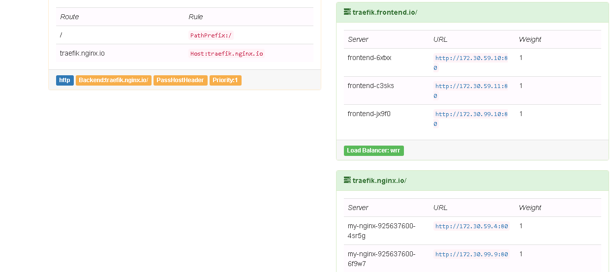

# Kubernetes traefik ingress安装

## Ingress简介

如果你还不了解，ingress是什么，可以先看下我翻译的Kubernetes官网上ingress的介绍[Kubernetes Ingress解析](http://rootsongjc.github.io/blogs/kubernetes-ingress-resource/)。

**理解Ingress**

简单的说，ingress就是从kubernetes集群外访问集群的入口，将用户的URL请求转发到不同的service上。Ingress相当于nginx、apache等负载均衡方向代理服务器，其中还包括规则定义，即URL的路由信息，路由信息得的刷新由[Ingress controller](https://kubernetes.io/docs/concepts/services-networking/ingress/#ingress-controllers)来提供。

**理解Ingress Controller**

Ingress Controller 实质上可以理解为是个监视器，Ingress Controller 通过不断地跟 kubernetes API 打交道，实时的感知后端 service、pod 等变化，比如新增和减少 pod，service 增加与减少等；当得到这些变化信息后，Ingress Controller 再结合下文的 Ingress 生成配置，然后更新反向代理负载均衡器，并刷新其配置，达到服务发现的作用。

## 部署Traefik

**介绍traefik**

[Traefik](https://traefik.io/)是一款开源的反向代理与负载均衡工具。它最大的优点是能够与常见的微服务系统直接整合，可以实现自动化动态配置。目前支持Docker, Swarm, Mesos/Marathon, Mesos, Kubernetes, Consul, Etcd, Zookeeper, BoltDB, Rest API等等后端模型。

以下配置文件可以在[yaml/traefik-ingress/](yaml/traefik-ingress/)目录下找到。

**创建ingress-rbac.yaml**

将用于service account验证。

```Yaml
apiVersion: v1
kind: ServiceAccount
metadata:
  name: ingress
  namespace: kube-system

---

kind: ClusterRoleBinding
apiVersion: rbac.authorization.k8s.io/v1beta1
metadata:
  name: ingress
subjects:
  - kind: ServiceAccount
    name: ingress
    namespace: kube-system
roleRef:
  kind: ClusterRole
  name: cluster-admin
  apiGroup: rbac.authorization.k8s.io
```

**创建`ingress.yaml`**

```yaml
# cat ingress.yaml
apiVersion: extensions/v1beta1
kind: Ingress
metadata:
  name: traefik-ingress
spec:
  rules:
  - host: traefik.nginx.io
    http:
      paths:
      - path: /
        backend:
          serviceName: my-nginx
          servicePort: 80
  - host: traefik.frontend.io
    http:
      paths:
      - path: /
        backend:
          serviceName: frontend
          servicePort: 80
```

这其中的`backend`中要配置default namespace中启动的service名字。`path`就是URL地址后的路径，如traefik.frontend.io/path，service将会接受path这个路径，host最好使用service-name.filed1.filed2.domain-name这种类似主机名称的命名方式，方便区分服务。

根据你自己环境中部署的service的名字和端口自行修改，有新service增加时，修改该文件后可以使用`kubectl replace -f ingress.yaml`来更新。

我们现在集群中已经有几个nginx的service了。

**创建文件traefik.yaml**

```yaml
# cat traefik.yaml
apiVersion: extensions/v1beta1
kind: Deployment
metadata:
  name: traefik-ingress-lb
  namespace: kube-system
  labels:
    k8s-app: traefik-ingress-lb
spec:
  template:
    metadata:
      labels:
        k8s-app: traefik-ingress-lb
        name: traefik-ingress-lb
    spec:
      terminationGracePeriodSeconds: 60
      hostNetwork: true
      restartPolicy: Always
      serviceAccountName: ingress
      containers:
      - image: traefik
        name: traefik-ingress-lb
        resources:
          limits:
            cpu: 200m
            memory: 30Mi
          requests:
            cpu: 100m
            memory: 20Mi
        ports:
        - name: http
          containerPort: 80
          hostPort: 80
        - name: admin
          containerPort: 8580
          hostPort: 8580
        args:
        - --web
        - --web.address=:8580
        - --kubernetes

```

注意我们这里用的是Deploy类型，没有限定该pod运行在哪个主机上。Traefik的端口是8580。

**创建文件ui.yaml**

```yaml
apiVersion: v1
kind: Service
metadata:
  name: traefik-web-ui
  namespace: kube-system
spec:
  selector:
    k8s-app: traefik-ingress-lb
  ports:
  - name: web
    port: 80
    targetPort: 8580
---
apiVersion: extensions/v1beta1
kind: Ingress
metadata:
  name: traefik-web-ui
  namespace: kube-system
spec:
  rules:
  - host: traefik-ui.local
    http:
      paths:
      - path: /
        backend:
          serviceName: traefik-web-ui
          servicePort: web
```

配置完成后就可以启动treafik ingress了。

```
# kubectl create -f .
serviceaccount "ingress" created
clusterrolebinding "ingress" created
ingress "traefik-ingress" created
deployment "traefik-ingress-lb" created
service "traefik-web-ui" created
ingress "traefik-web-ui" created

```

我查看到traefik的pod在`192.168.1.122`这台节点上启动了。

访问该地址`http://192.168.1.122:8580/`将可以看到dashboard。



左侧黄色部分部分列出的是所有的rule，右侧绿色部分是所有的backend。

## 测试

在集群的任意一个节点上执行。假如现在我要访问nginx的"/"路径。

```bash
$ curl -H Host:traefik.nginx.io http://192.168.1.122/
<!DOCTYPE html>
<html>
<head>
<title>Welcome to nginx!</title>
<style>
    body {
        width: 35em;
        margin: 0 auto;
        font-family: Tahoma, Verdana, Arial, sans-serif;
    }
</style>
</head>
<body>
<h1>Welcome to nginx!</h1>
<p>If you see this page, the nginx web server is successfully installed and
working. Further configuration is required.</p>

<p>For online documentation and support please refer to
<a href="http://nginx.org/">nginx.org</a>.<br/>
Commercial support is available at
<a href="http://nginx.com/">nginx.com</a>.</p>

<p><em>Thank you for using nginx.</em></p>
</body>
</html>
```
##例子：

根据namespace来指定后端service，host主机名可以自定义指定
```
apiVersion: extensions/v1beta1
kind: Ingress
metadata:
  name: test
  namespace: kube-system
spec:
  rules:
  - host: fix.es.io
    http:
      paths:
      - path: /
        backend:
          serviceName: elasticsearch-logging
          servicePort: 9200
  - host: fix.dash.io
    http:
      paths:
      - path: /
        backend:
          serviceName: kubernetes-dashboard
          servicePort: 80
```
```

# curl fix.es.io
{
  "name" : "Thermo",
  "cluster_name" : "elasticsearch",
  "version" : {
    "number" : "2.3.2",
    "build_hash" : "b9e4a6acad4008027e4038f6abed7f7dba346f94",
    "build_timestamp" : "2016-04-21T16:03:47Z",
    "build_snapshot" : false,
    "lucene_version" : "5.5.0"
  },
  "tagline" : "You Know, for Search"
}
# curl fix.dash.io
 <!doctype html> <html ng-app="kubernetesDashboard"> <head> <meta charset="utf-8"> <title ng-controller="kdTitle as $ctrl" ng-bind="$ctrl.title()"></title> <link rel="icon" type="image/png" href="assets/images/kubernetes-logo.png"> <meta name="viewport" content="width=device-width"> <link rel="stylesheet" href="static/vendor.4f4b705f.css"> <link rel="stylesheet" href="static/app.93b90a74.css"> </head> <body> <!--[if lt IE 10]>
      <p class="browsehappy">You are using an <strong>outdated</strong> browser.
      Please <a href="http://browsehappy.com/">upgrade your browser</a> to improve your
      experience.</p>
    <![endif]--> <kd-chrome layout="column" layout-fill> </kd-chrome> <script src="static/vendor.6952e31e.js"></script> <script src="api/appConfig.json"></script> <script src="static/app.8a6b8127.js"></script> </body> </html> 
```

如果你需要在kubernetes集群以外访问就需要设置DNS，或者修改本机的hosts文件。

在其中加入：

```
192.168.1.122 traefik.nginx.io fix.es.io fix.dash.io

```

所有访问这些地址的流量都会发送给192.168.1.122这台主机，就是我们启动traefik的主机。

Traefik会解析http请求header里的Host参数将流量转发给Ingress配置里的相应service。

修改hosts后就就可以在kubernetes集群外访问以上service，如下图：


## 参考

[Traefik-kubernetes 初试](http://www.colabug.com/thread-1703745-1-1.html)

[Traefik简介](http://www.tuicool.com/articles/ZnuEfay)

[Guestbook example](https://github.com/kubernetes/kubernetes/tree/master/examples/guestbook)